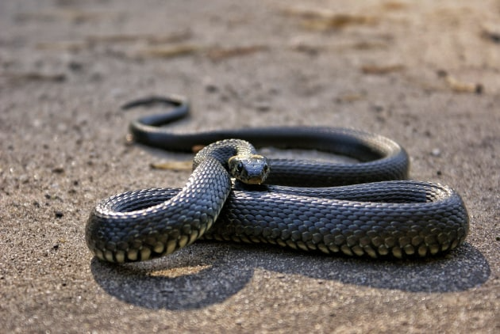

# AdaLayer-CAM

This repository contains the official implementation of the paper:
"AdaLayer-CAM: Adaptive Multi-Layer Method for Visualization and Explanation of CNNs".


# AdaLayer-CAM: Adaptive Multi-Layer Method for Visualization and Explanation of CNNs

This repository contains the **official PyTorch implementation** of the paper:

**"AdaLayer-CAM: Adaptive Multi-Layer Method for Visualization and Explanation of CNNs"**  
M. J. GhaderiPoor, L. PourMohammadBagher, Z. Rahimi  
(2025 — under review)

---

## Run the demo

To quickly test AdaLayer-CAM in your browser using Google Colab:

[](
https://colab.research.google.com/github/<your-username>/AdaLayer-CAM/blob/main/notebooks/AdaLayerCAM_Demo.ipynb
)

*(لینک را بعداً با لینک واقعی نوت‌بوک خودت جایگزین کن.)*

---

## Overview

AdaLayer-CAM یک روش **کامل چندلایه‌ای** برای تولید Class Activation Map در شبکه‌های کانولوشنی است.  
این روش برخلاف Grad-CAM یا LayerCAM تنها از یک یا چند لایه استفاده نمی‌کند، بلکه:

- از **تمام** لایه‌های کانولوشنی استفاده می‌کند،
- برای هر لایه وزن تطبیقی مبتنی بر **activation energy** محاسبه می‌کند،
- خروجی‌ها را با یک **Soft-ReLU fusion** ترکیب می‌کند،
- و در نتیجه نقشه‌های توجه **شفاف‌تر، دقیق‌تر و کم‌نویزتر** تولید می‌کند.

این مخزن شامل پیاده‌سازی کامل، اسکریپت‌های آزمایش، و نوت‌بوک Colab است.

---

## Features

- ✔ Fully multi-layer CAM (استفاده از *تمام* لایه‌های کانولوشنی)
- ✔ Adaptive weighting based on activation energy
- ✔ Soft-ReLU fusion for stable and less noisy CAMs
- ✔ PyTorch implementation (plug-and-play)
- ✔ Scripts for reproducing ImageNet & Pascal VOC results
- ✔ Google Colab demo

---

## Installation

### 1. Clone the repository

```bash
git clone https://github.com/<your-username>/AdaLayer-CAM.git
cd AdaLayer-CAM
```

### 2. Install dependencies

```bash
pip install -r requirements.txt
```

Minimal dependencies:

```
torch>=2.0
torchvision>=0.15
numpy
matplotlib
opencv-python
pillow
tqdm
```

---

## Quick Start

A minimal working example:

```python
import torch
import torchvision.models as models
from src.adalayer_cam.adalayer_cam import AdaLayerCAM
from src.utils.visualization import visualize_cam_on_image

model = models.resnet50(weights=models.ResNet50_Weights.IMAGENET1K_V1)
model.eval()

adalayer = AdaLayerCAM(model=model, target_layers="all")

img = ...  # preprocessed input
cam = adalayer(img, target_class=None)

out = visualize_cam_on_image(img, cam)
out.save("result.png")
```

نسخه کامل‌تر در پوشه examples و نوت‌بوک Colab موجود است.

---

## Directory Structure

```
AdaLayer-CAM/
│
├── src/
│   ├── adalayer_cam/
│   │   ├── adalayer_cam.py
│   │   ├── layer_cam.py
│   │   ├── grad_cam.py
│   │   ├── score_cam.py
│   │   └── cam_base.py
│   └── utils/
│       ├── visualization.py
│       ├── metrics.py
│       └── data.py
│
├── examples/
│   └── simple_inference.py
│
├── notebooks/
│   └── AdaLayerCAM_Demo.ipynb
│
├── experiments/
│   ├── configs/
│   └── run_imagenet.py
│
├── assets/
│   └── figures/
│
├── requirements.txt
├── CITATION.cff
├── LICENSE
└── README.md
```

---

## Reproducing Results

### 1. Set dataset paths  
در فایل‌های config قرار داده شده در پوشه:

```
experiments/configs/
```

### 2. Run experiments

```bash
python experiments/run_imagenet.py \
    --config experiments/configs/resnet50_imagenet.yaml \
    --method adalayer_cam
```

Metrics included:

- Average Drop (%)
- Insertion AUC
- Deletion AUC
- Pointing Game accuracy

---

## Citation

```bibtex
@article{GhaderiPoor2025AdaLayerCAM,
  title={AdaLayer-CAM: Adaptive Multi-Layer Method for Visualization and Explanation of CNNs},
  author={GhaderiPoor, MohammadJavad and PourMohammadBagher, Latifeh and Rahimi, Zahra},
  year={2025},
  journal={...}
}
```

---

## License

MIT License.

---

## Contact

- **MohammadJavad GhaderiPoor** — mohammadjavadghaderipoor@gmail.com  
- **Latifeh PourMohammadBagher** — l_pmb@atu.ac.ir  
- **Zahra Rahimi** — za.rah@atu.ac.ir

  

## Example Results

<p align="center">
  
  
</p>


coming soon...
