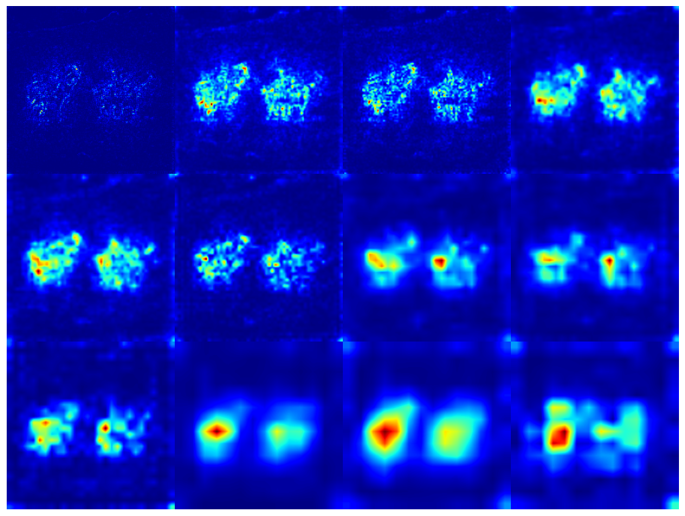
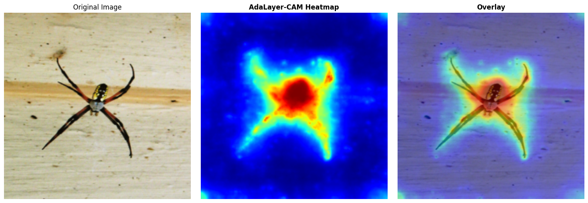

# AdaLayer-CAM

This repository contains the official implementation of the paper:<br>
**"AdaLayer-CAM: Adaptive Multi-Layer Method for Visualization and Explanation of CNNs"**  
M. J. GhaderiPoor, L. PourMohammadBagher, Z. Rahimi  


---

# 🚀 Run AdaLayer-CAM in Google Colab
The simplest way to try AdaLayer-CAM is through Google Colab:
[](https://colab.research.google.com/github/mhmdjgh/AdaLayer-CAM/blob/main/AdaLayer_CAM.ipynb)


---

## 📘 Overview

- Generates class activation maps using **all convolutional layers**.  
- Assigns **adaptive, data-driven weights** based on activation energy.  
- Refines each layer’s map before fusion.  
- Combines all maps using a **soft sigmoid-based fusion**.  
- Produces heatmaps that are **more detailed, cleaner, and more stable**—without modifying or retraining the model.
 
---


## Example Results

<p align="center">
  
  
</p>

<p align="center">
  
  
</p>

<p align="center">
  
  
  
  
</p>


---

## 📝 Citation

If you use this work, please cite:

```bibtex
@article{GhaderiPoor2025AdaLayerCAM,
  title     = {AdaLayer-CAM: Adaptive Multi-Layer Method for Visualization and Explanation of CNNs},
  author    = {GhaderiPoor, MohammadJavad and PourMohammadBagher, Latifeh and Rahimi, Zahra},
  booktitle = {Proceedings of the IEEE/CVF International Conference on Computer Vision (ICCV)},
  year      = {2025},
  pages     = {...},
}

```

---


## 📬 Contact

For questions or collaborations:

- **MohammadJavad GhaderiPoor** — mohammadjavadghaderipoor@gmail.com  

